<div align="center">

# 📚 SpeakEase – AI Powered English Practice App

### 🚀 Learn • Practice • Improve • Track

An AI-powered English Learning Platform built with **React.js**, **Firebase**, **Tailwind CSS**, and **Google Gemini AI**.

Practice English through interactive exercises, AI-powered writing evaluation, progress tracking, real-time collaboration, and role-based dashboards.

<br>

[](https://getspeakease.vercel.app/)

[](https://github.com/Narendra-kushwaha/English-Speaking-Practice-App)

<br>


</div>

---

# 📖 Table of Contents

- 🌟 About Project
- ✨ Features
- 👥 User Roles
- 📸 Screenshots
- 🛠 Tech Stack
- 📂 Project Structure
- 🚀 Installation
- 🔑 Environment Variables
- 🔐 Authentication Flow
- 📊 Dashboard Overview
- 🤖 AI Features
- 📈 Analytics
- ⚠️ Common Errors
- 🛣 Roadmap
- 👨‍💻 Author
- 📄 License

---

# 🌟 About the Project

SpeakEase is a modern AI-powered English learning platform designed to help students improve their English communication skills through interactive practice sessions, AI-assisted writing evaluation, and detailed performance analytics.

Unlike traditional practice websites, SpeakEase provides **role-based dashboards** for Students, Admins, and Developers, making it suitable for coaching institutes, schools, English learning communities, and individual learners.

The platform combines **Firebase Authentication**, **Cloud Firestore**, **Realtime Database**, and **Google Gemini AI** to deliver a secure, scalable, and intelligent learning experience.

---

# 🚀 Why SpeakEase?

✔ AI-powered Writing Feedback

✔ Fill in the Blanks Practice

✔ Hindi to English Translation

✔ Writing Practice

✔ Daily Progress Tracking

✔ Permanent Admin ID

✔ Student Analytics

✔ Group Discussions

✔ Top 3 Leaderboard

✔ Role-Based Authentication

✔ Secure Firebase Backend

✔ Responsive UI

---

# 👥 User Roles

| Role | Description |
|------|-------------|
| 👨‍🎓 Student | Practice English, track progress, join discussions, receive AI feedback |
| 👨‍🏫 Admin | Manage students, create questions, monitor analytics, manage groups |
| 👨‍💻 Developer | Manage admin accounts, monitor platform, control administration |

---

# ✨ Features

## 👨‍🎓 Student Features

- Secure Email Authentication
- Email Verification
- Register using Permanent Admin ID
- Fill in the Blanks
- Hindi → English Practice
- Writing Practice
- AI Writing Evaluation
- Daily Progress
- Total Score
- Level-wise Progress
- Accuracy Tracking
- Group Discussion
- Account Settings
- Change Password
- Change Email
- Change Mobile Number

---

## 👨‍🏫 Admin Features

- Permanent 8-Digit Admin ID
- Question Manager
- Student Manager
- Student Analytics
- Today's Performance
- Total Performance
- Level-wise Reports
- Top 3 Leaderboard
- Block / Unblock Students
- Group Discussion
- Batch Management
- Account Settings

---

## 👨‍💻 Developer Features

- Hidden Developer Login
- Secret Authentication
- View All Admins
- Manage Admin Accounts
- Block / Unblock Admins
- Account Settings

---

# 📸 Screenshots

## 🔐 Authentication

| Student Login | Student Registration |
|----------------|----------------------|
| 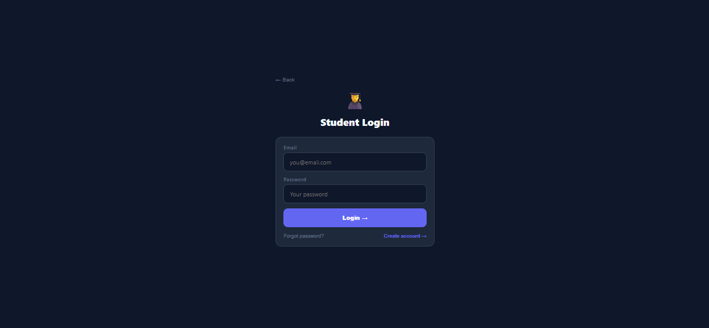 | 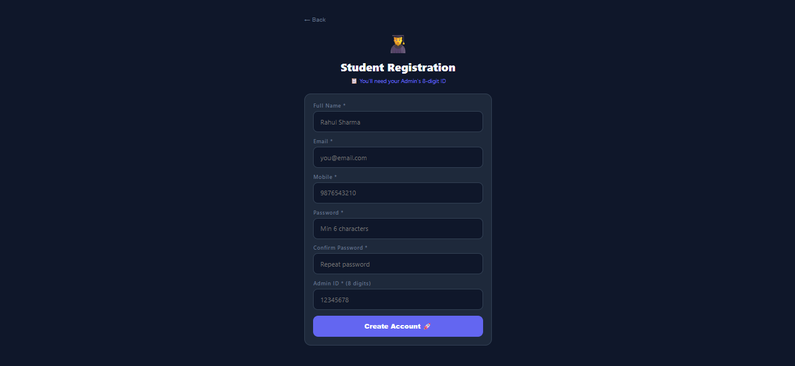 |

---

## 👨‍🎓 Student Dashboard

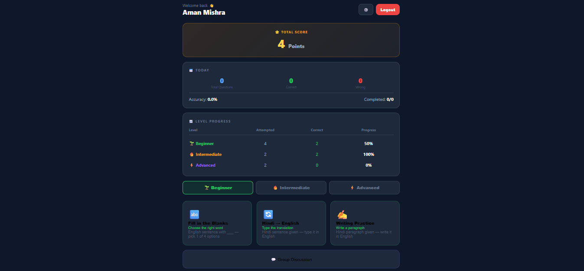

---

## 📚 Practice Modes

| Fill in the Blanks | Hindi → English |
|--------------------|-----------------|
| 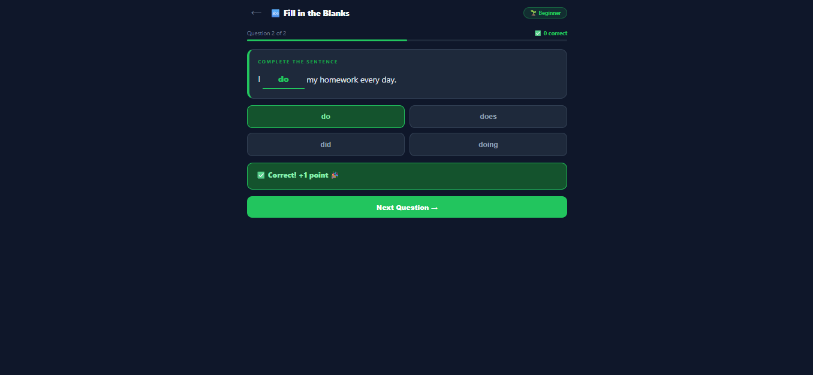 | 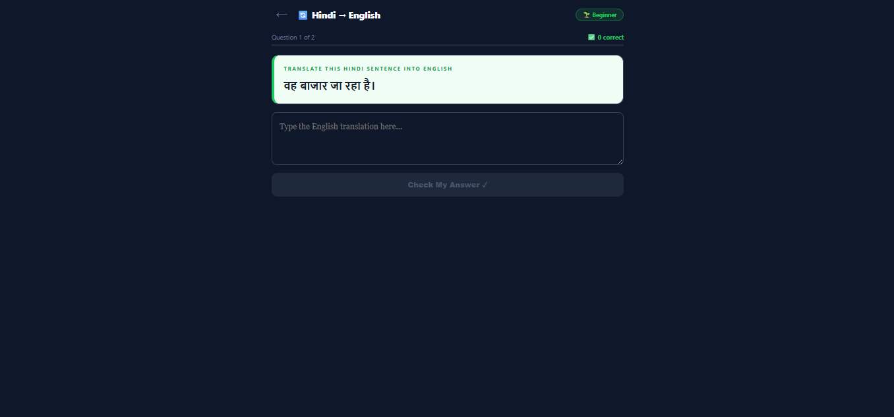 |

---

### ✍ Writing Practice

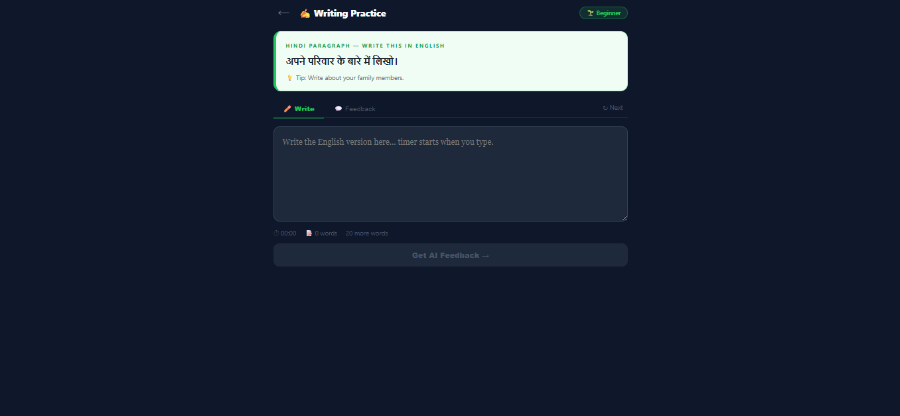

---

## 👨‍🏫 Admin Dashboard

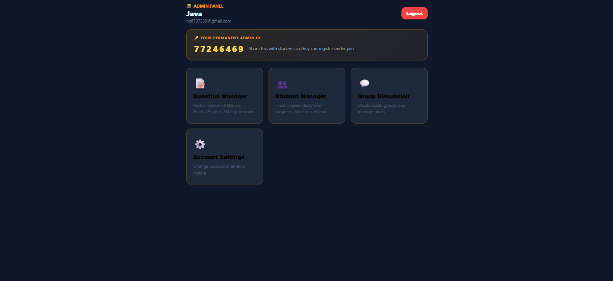

---

## 📋 Question Manager

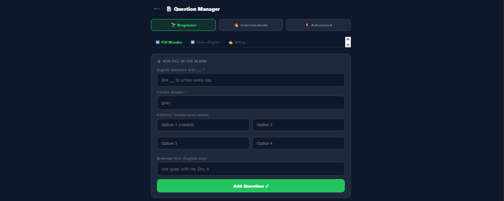

---

## 👨‍🎓 Student Manager

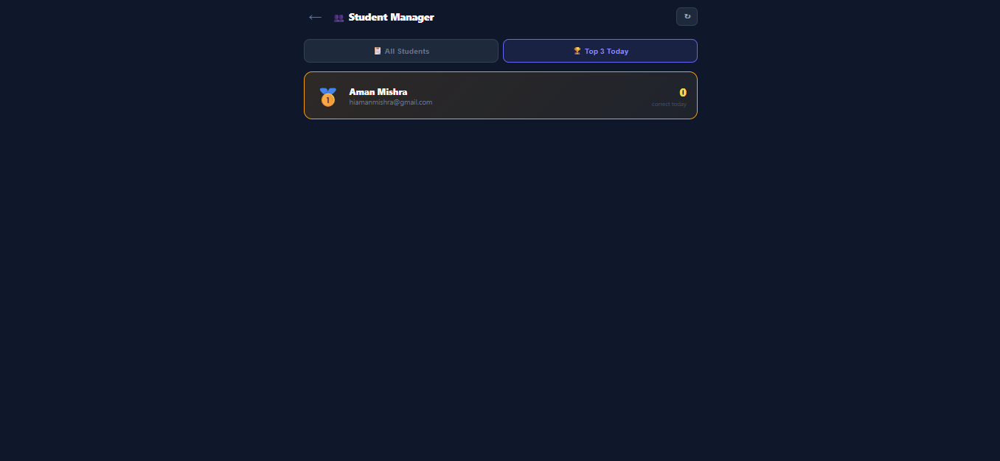

---

## 💬 Group Discussion

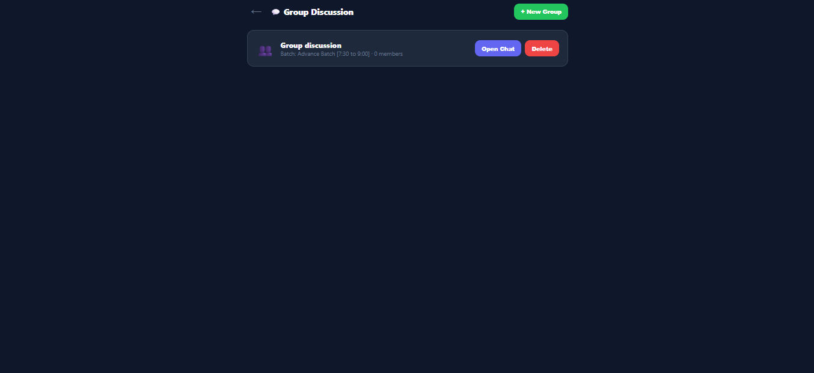

---

## ⚙ Account Settings

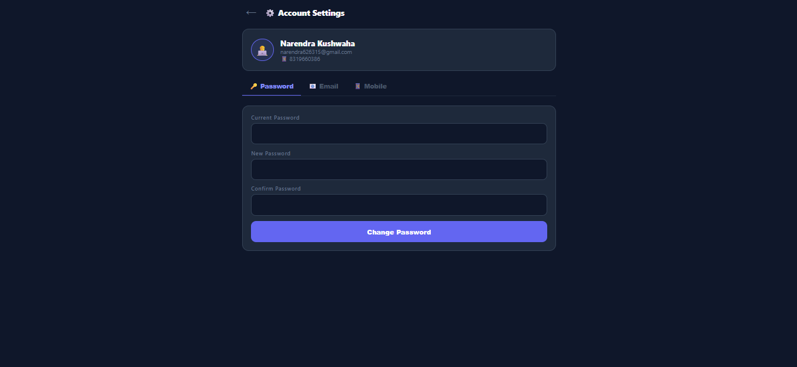

---

## 👨‍💻 Developer Dashboard


---

## 🛡 All Admins

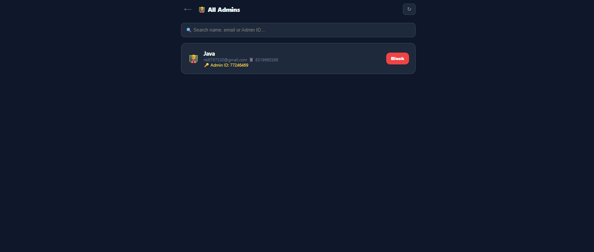

---

# 🛠 Tech Stack

| Category | Technology |
|----------|------------|
| Frontend | React.js |
| Styling | Tailwind CSS |
| Authentication | Firebase Authentication |
| Database | Cloud Firestore |
| Realtime Database | Firebase Realtime Database |
| AI Integration | Google Gemini AI |
| Routing | React Router DOM |
| State Management | React Hooks |
| Deployment | Vercel |
| Version Control | Git & GitHub |

---

# 🏗 Project Architecture

```text
                    +----------------------+
                    |      React App       |
                    +----------+-----------+
                               |
             +-----------------+-----------------+
             |                                   |
      Firebase Authentication            Google Gemini AI
             |                                   |
             |                          Writing Feedback
             |
    +--------+---------+
    |                  |
 Cloud Firestore   Realtime Database
    |                  |
 Users / Questions   Group Discussions
 Progress            Live Chat
 Analytics
```

---

# 📂 Project Structure

```text
english-practice/
│
├── public/
│   └── index.html
│
├── src/
│   ├── App.jsx
│   ├── index.js
│   ├── keys.js
│   │
│   ├── hooks/
│   │   └── useAuth.js
│   │
│   ├── data/
│   │   └── questions.js
│   │
│   ├── utils/
│   │   ├── setup.js
│   │   ├── auth.js
│   │   ├── ai.js
│   │   ├── progress.js
│   │   └── store.js
│   │
│   └── components/
│       ├── auth/
│       ├── student/
│       ├── admin/
│       ├── developer/
│       └── shared/
│
├── screenshots/
│
├── package.json
│
└── README.md
```

---

# 🚀 Getting Started

## 1️⃣ Clone the Repository

```bash
git clone https://github.com/Narendra-kushwaha/English-Speaking-Practice-App.git
```

---

## 2️⃣ Navigate to Project Folder

```bash
cd English-Speaking-Practice-App
```

---

## 3️⃣ Install Dependencies

```bash
npm install
```

---

## 4️⃣ Start Development Server

```bash
npm start
```

Application will run at:

```
http://localhost:3000
```

---

# 🔑 Environment Variables

Create a file named:

```text
src/keys.js
```

Add the following configuration:

```javascript
export const GEMINI_KEY = "YOUR_GEMINI_API_KEY";

export const FB = {
  apiKey: "",
  authDomain: "",
  projectId: "",
  storageBucket: "",
  messagingSenderId: "",
  appId: "",
  databaseURL: ""
};

export const DEV_SECRET = "YOUR_DEVELOPER_SECRET";
```

---

# 🔥 Firebase Setup

## Step 1

Create Firebase Project

```
Firebase Console
      ↓
Add Project
      ↓
Create
```

---

## Step 2

Enable Authentication

```
Authentication
      ↓
Get Started
      ↓
Email/Password
      ↓
Enable
```

---

## Step 3

Create Firestore Database

```
Firestore Database
      ↓
Create Database
      ↓
Test Mode
```

---

## Step 4

Create Realtime Database

```
Realtime Database
      ↓
Create Database
      ↓
Test Mode
```

---

## Step 5

Register Web App

```
Project Settings
      ↓
Add Web App
      ↓
Copy Firebase Config
```

Paste the configuration inside:

```text
src/keys.js
```

---

# 🤖 Google Gemini AI Setup

## Step 1

Visit

```
https://aistudio.google.com/app/apikey
```

---

## Step 2

Generate a new API Key.

---

## Step 3

Paste it into:

```javascript
export const GEMINI_KEY = "YOUR_API_KEY";
```

---

# ⚙ First Time Setup

```text
Developer Registration
          │
          ▼
Developer Login
          │
          ▼
Create Admin
          │
          ▼
Admin Receives Permanent Admin ID
          │
          ▼
Student Registration
          │
          ▼
Email Verification
          │
          ▼
Student Login
          │
          ▼
Practice English
```

---

# 📦 Production Build

Create an optimized production build:

```bash
npm run build
```

---

# ☁ Deployment

The application is deployed on **Vercel**.

To deploy your own version:

```bash
npm install -g vercel
```

```bash
vercel
```

Follow the on-screen instructions to complete deployment.

---

# 📱 Browser Support

✅ Google Chrome

✅ Microsoft Edge

✅ Mozilla Firefox

✅ Brave Browser

✅ Opera

---

# 🔒 Security Features

- Firebase Authentication
- Email Verification
- Protected Routes
- Role-Based Access Control
- Permanent Admin ID Verification
- Developer Secret Authentication
- Secure Firestore Access
- Current Password Verification for Sensitive Changes

---

# 🔐 Authentication Flow

```text
                    👨‍💻 Developer
                           │
                           ▼
              Register using Developer Secret
                           │
                           ▼
                   Developer Dashboard
                           │
                           ▼
                  Create / Manage Admins
                           │
                           ▼
             👨‍🏫 Admin Registration
                           │
                           ▼
        Permanent 8-Digit Admin ID Generated
                           │
                           ▼
              👨‍🎓 Student Registration
             (Using Admin's Permanent ID)
                           │
                           ▼
                Email Verification Required
                           │
                           ▼
                      Student Login
                           │
                           ▼
                  Student Dashboard
```

---

# 📊 Dashboard Overview

## 👨‍🎓 Student Dashboard

The Student Dashboard provides a complete overview of the learner's progress and performance.

### Features

- 🏆 Total Score
- 📅 Today's Performance
- 📈 Accuracy Percentage
- 🎯 Attempted Questions
- ✅ Correct Answers
- ❌ Wrong Answers
- 📚 Level-wise Progress
- 📝 Practice Modes
- 💬 Group Discussion
- ⚙ Account Settings

---

## 👨‍🏫 Admin Dashboard

The Admin Dashboard helps instructors monitor students and manage learning resources.

### Features

- 🔑 Permanent Admin ID
- 📚 Question Manager
- 👨‍🎓 Student Manager
- 📊 Student Analytics
- 🥇 Daily Top 3 Students
- 💬 Group Discussion
- ⚙ Account Settings

---

## 👨‍💻 Developer Dashboard

The Developer Dashboard provides administrative control over the platform.

### Features

- 👨‍🏫 View All Admins
- 🚫 Block / Unblock Admins
- 🔒 Developer Authentication
- ⚙ Account Settings

---

# 📚 Practice Modes

## 🔤 Fill in the Blanks

Students complete English sentences by selecting the correct option.

### Highlights

- Multiple Choice Questions
- Instant Result
- Score Tracking
- Level-wise Questions
- Grammar Hints
- Progress Update

---

## 🌍 Hindi → English

Students translate Hindi sentences into English.

### Highlights

- Translation Practice
- Grammar Improvement
- Vocabulary Building
- Instant Evaluation
- Level-wise Questions

---

## ✍ Writing Practice

Students write English paragraphs based on Hindi prompts.

Google Gemini AI analyzes the response and provides intelligent feedback.

### AI Feedback Includes

- Grammar Corrections
- Better Sentence Formation
- Vocabulary Suggestions
- Writing Quality
- Overall Feedback

---

# 🤖 AI Features

SpeakEase uses **Google Gemini AI** to make learning smarter.

### AI Capabilities

- Grammar Checking
- Writing Evaluation
- Sentence Improvement
- Writing Suggestions
- Constructive Feedback

---

# 📈 Student Analytics

Each student's progress is automatically tracked.

## Overall Statistics

- Total Questions Attempted
- Total Correct Answers
- Total Wrong Answers
- Overall Accuracy
- Total Score

---

## Daily Statistics

- Today's Attempts
- Today's Correct Answers
- Today's Wrong Answers
- Daily Accuracy

---

## Level-wise Analytics

### 🌱 Beginner

- Attempted
- Correct
- Progress

### 🔥 Intermediate

- Attempted
- Correct
- Progress

### ⚡ Advanced

- Attempted
- Correct
- Progress

---

# 🏆 Daily Leaderboard

Admins can view the Top 3 students based on today's performance.

Ranking is automatically generated using:

- Correct Answers
- Daily Performance
- Accuracy

Displayed as:

🥇 Rank 1

🥈 Rank 2

🥉 Rank 3

---

# 💬 Group Discussion

Students can participate in group discussions created by their Admin.

### Features

- Batch-wise Groups
- Real-time Messaging
- Student Name Visibility
- Private Progress
- Secure Communication

---

# 📂 Firebase Collections

```text
Firestore

users
│
├── student
├── admin
└── developer

questions
│
├── beginner
├── intermediate
└── advanced

progress

attempts

groups
```

---

# 🔄 Data Flow

```text
Student
     │
     ▼
Practice Question
     │
     ▼
Answer Submission
     │
     ▼
Firestore
     │
     ▼
Progress Updated
     │
     ▼
Dashboard Updated
     │
     ▼
Leaderboard Updated
```

---

# 🔒 Security

The application uses multiple security layers.

- Firebase Authentication
- Email Verification
- Role-Based Authorization
- Protected Routes
- Developer Secret
- Permanent Admin ID Validation
- Password Reauthentication
- Firestore Access Control

---

# ⚠ Common Errors

| Error | Cause | Solution |
|--------|-------|----------|
| Blank Screen | Firebase Config Missing | Check `keys.js` |
| Invalid Admin ID | Wrong Admin ID | Enter a valid 8-digit ID |
| Login Failed | Email Not Verified | Verify your email |
| AI Feedback Not Working | Invalid Gemini API Key | Update API Key |
| Password Change Failed | Incorrect Current Password | Re-enter the current password |
| Firebase Permission Error | Firestore Rules | Check Firebase Rules |

---

# 💡 Best Practices

- Verify email before logging in.
- Keep your Firebase keys secure.
- Never upload `keys.js` to GitHub.
- Use environment variables for production.
- Enable Firebase Security Rules before deployment.
- Regularly back up Firestore data.
- Rotate Developer Secret periodically.

---

# ⚡ Performance Optimizations

- Lazy Loading Components
- Optimized React Hooks
- Firebase Real-time Updates
- Efficient Firestore Queries
- Responsive UI
- Fast Page Navigation
- Lightweight Component Structure

---

# 🛣️ Roadmap

The following features are planned for future releases:

- [ ] 🎙 Voice Practice Mode
- [ ] 🔊 Pronunciation Checker
- [ ] 🤖 AI Speaking Assistant
- [ ] 📜 Downloadable Certificates
- [ ] 🏅 Achievement Badges
- [ ] 🔥 Daily Challenges
- [ ] 📱 Android Application
- [ ] 🍎 iOS Application
- [ ] 🌙 Dark Mode
- [ ] 🔔 Push Notifications
- [ ] 📊 Advanced Analytics
- [ ] 🎥 Live Speaking Room
- [ ] 👥 Video Group Discussion
- [ ] 🌍 Multi-language Support
- [ ] 📈 Weekly & Monthly Reports

---

# 📈 Project Highlights

✔ AI Powered English Learning

✔ Three Role Based System

✔ Firebase Authentication

✔ Firestore Database

✔ Realtime Group Discussion

✔ Google Gemini AI Integration

✔ Student Progress Tracking

✔ Daily Leaderboard

✔ Responsive Design

✔ Modern UI

---

# 🎯 Use Cases

This project is suitable for:

- English Coaching Institutes
- Schools & Colleges
- Individual Learners
- Online English Trainers
- Speaking Practice Communities
- Educational Startups

---

# 🌍 Responsive Design

The application is optimized for:

- 💻 Desktop
- 💼 Laptop
- 📱 Mobile
- 📟 Tablet

---

# 🚀 Deployment

The application is deployed on **Vercel**.

### Live Website

🌐 https://getspeakease.vercel.app/

---

# 📦 Repository

GitHub Repository

https://github.com/Narendra-kushwaha/English-Speaking-Practice-App

---

# 🤝 Contributing

Contributions are always welcome.

If you'd like to improve this project:

1. Fork the repository

2. Create a new feature branch

```bash
git checkout -b feature/YourFeature
```

3. Commit your changes

```bash
git commit -m "Add new feature"
```

4. Push the branch

```bash
git push origin feature/YourFeature
```

5. Create a Pull Request

---

# 🐞 Found a Bug?

If you find any bug or want to suggest improvements,

please create a new Issue in the GitHub repository.

---

# ⭐ Support

If you found this project useful,

please consider giving it a ⭐ Star.

It motivates me to build more useful open-source projects.

---

# 📬 Contact

### 👨‍💻 Developer

**Raja Kushwaha**

📧 Email

YOUR_EMAIL_HERE

💼 LinkedIn

YOUR_LINKEDIN_URL

🌐 Portfolio

YOUR_PORTFOLIO_URL

🐙 GitHub

https://github.com/Narendra-kushwaha

---

# 🙏 Acknowledgements

Special thanks to:

- React Team
- Firebase Team
- Google Gemini AI
- Tailwind CSS
- Open Source Community

---

# 📄 License

This project is licensed under the **MIT License**.

You are free to use, modify, and distribute this project with proper attribution.

---

<div align="center">

## 🌟 Thank You for Visiting!

If you like this project,

please don't forget to ⭐ the repository.

### Made with ❤️ using React, Firebase & Google Gemini AI

</div>
